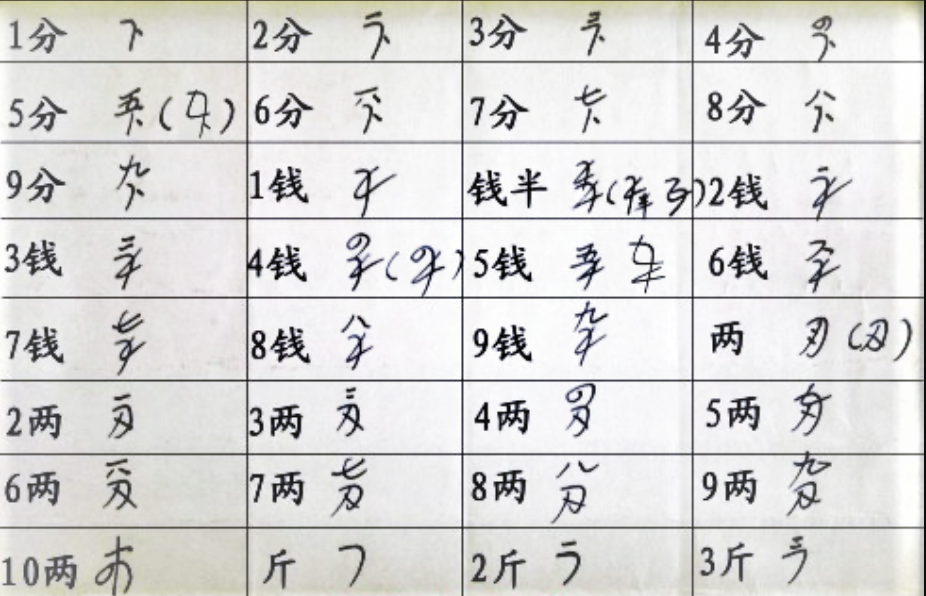
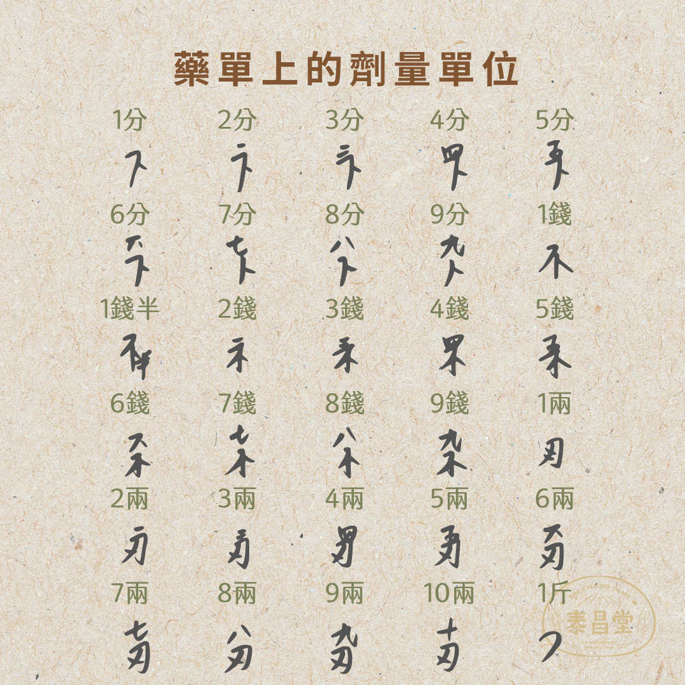
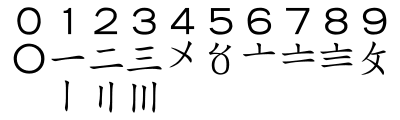

# Chinese Medicines' Cheetsheet
## Content
- [藥方符號](#藥方符號)
- [常見藥材](#常見藥材)
- [易混淆藥材](#易混淆藥材)

## 藥方符號

- 卜=分
- 不=錢
- 刃=兩
- 丿=斤

## 常見藥材
1. 丹蔘 (放射狀的灰黃色或黃白色木質部導管束)
    - 根呈**圓柱形**，稍彎曲
    - 表面呈**磚紅色**，**粗糙**
    - 具多數縱溝或皺紋，有鬚根痕
    - 外部栓皮常鱗片狀剝落，皮層有時開裂
    - 長 8 ~ 22 cm，直徑 5 ~ 12 mm
    - 質堅脆，易折斷，斷面不平，疏鬆有裂隙
    - **皮部棕渴色或磚紅色**
    - **韌皮部狹**
    - **形成層明顯，淡棕色**
    - **木質部導管束灰黃色或黃白色，放射狀排列**
    - 氣微，味微苦、澀

    
    
    
    
    

2. 乳香 (玻璃样、蜡样光泽)
    - 本品呈**长卵形滴乳状、类圆形颗粒或粘合成大小不等的不规则块状物**。
    - 大者长达 2 cm（乳香珠）或 5 cm（原乳香）。
    - **表面黄白色，半透明**，被有黄白色粉末，**久存则颜色加深**。
    - **质脆**，遇热软化。
    - 破碎面有**玻璃样**或**蜡样光泽**。
    - 具特异香气，味微苦。

    
    
    

3. 厚朴(**小指甲、氣香**)
    - 幹皮：呈**捲筒狀或雙捲筒狀**，長 30 ~ 35 cm，厚 2 ~ 7 mm，習稱**筒朴**；近根部的幹皮一端展開如喇叭口，習稱**靴筒朴**。外表面灰棕色或灰褐色，粗糙，栓皮呈**鱗片狀**，較易剝落，有**明顯的橢圓形皮孔和縱皺紋**，**刮去栓皮者顯黃棕色；內表面紫棕色或深紫褐色**，具細密縱紋，劃之顯油痕。質堅硬，不易折斷。**斷面顆粒性**，外層灰棕色，內層紫褐色或棕色，有油性，有的可見多數小亮星。氣香，味辛辣，微苦。
    - 根皮 (根朴) ：為主根及支根的皮，厚 3 ~ 5 mm，形狀不一，有**捲筒狀、片塊狀、羊耳狀**等；細小很皮形彎曲如雞腸，習稱**雞腸朴**。**外表面灰黃色或灰褐色色**。質稍堅硬，較易折斷，斷面纖維性。
    - 枝皮 (枝朴) ：呈**單筒狀**，長 10 ~ 20 cm，厚 1 ~ 2 mm。**外表面灰褐色，內表面黃棕色**。質脆，易折斷，斷面纖維性。

    
    
    

4. 吳茱萸 (五角狀扁球形)
    - 果實呈**五角狀扁球形**
    - 直徑 2 ~ 5 mm
    - **表面暗黃綠色至褐色，粗糙**，有點狀突起或凹下的油點。
    - **頂端有五角星狀的裂隙**
    - **基部殘留被有黃色茸毛的果梗**
    - 質硬而脆。
    - 氣芳香濃郁，味辛辣而苦。

    
    
    
    
    

5. 土茯苓 (薄片、富粉質、邊緣淡紅棕色或類黃白色)
    - 乾燥根莖為**不規則塊狀**，略呈**扁圓柱形**而**彎曲不直**，**多分枝**，**有結節狀隆起**
    - 長約5 ~ 15cm，直徑約2 ~ 5cm
    - **表面土棕色或棕色，粗糙**，常有刀傷切口及側根殘餘部分，上端具莖痕；
    - 質堅硬，不易折斷，**斷面粗糙，有粉性，淡棕色**
    - 氣微，味甘淡。
    - **切片為長形薄片，大小不等，厚約1~3mm，邊緣不整齊，淡紅棕色或類白色**
    - 中間略具維管束點，仔細觀察時可見**砂礫樣的光亮**。
    - **縱切片常見花紋**。
    - 導管不規則，**富粉質**，微有彈性，**用水潤濕後，手摸之有光滑感**。

    
    

6. 地骨皮 (外灰黃粗糙、內黃白較平坦、有錯雜的縱裂紋)
    - 乾燥根皮為**短小的筒狀或槽狀卷片**
    - 大小不一，一般長 3 ~ 10 cm，寬 0.6 ~ 1.5 cm，厚約 3 mm。
    - **外表面灰黃色或棕黃色，粗糙**，有錯雜的縱裂紋，易剝落。
    - **內表面黃白色，較平坦，有細縱紋**。
    - **質輕脆，易折斷，斷面不平坦**，外層棕黃色，內層灰白色。
    - 臭微。
    - 味微甘。

    
    
    

7. 地鱉蟲
    - 地鱉：呈扁**平卵形**，長 1.3 ~ 3 cm，寬 1.2 ~ 2.4 cm。前端較窄，後端較寬，**背部紫褐色，具光澤，無翅**。前胸背板較發達，蓋住頭部；**腹背板9節**，呈覆瓦狀排列。**腹面紅棕色**，頭部較小，有絲狀觸角1對，常脫落，**胸部有足3對**，具細毛和刺。腹部有橫環節。**質鬆脆，易碎**。氣腥臭，味微鹹。
    - 冀地鱉：長 2.2 ~ 3.7 cm，寬 1.4 ~ 2.5 cm。**背部黑棕色，通常在邊緣帶有淡黃褐色斑塊及黑色小點**。
    
    
    
    
    
    
    

8. 地龍
    - 呈**長條狀薄片**，**彎曲**，**邊緣略卷**，長15 ~ 20cm，寬1 ~ 2cm。
    - **全體具環節，背部棕褐色至紫灰色，腹部淺黃棕色**；第14 ~ 16環節為生殖帶，習稱“白頸”，較光亮。
    - 體前端稍尖，尾端鈍圓，剛毛圈粗糙而硬，色稍淺。
    - 雄生殖孔在第 18 節腹側剛毛圈一小孔突上，外緣有數環繞的淺皮褶，內側剛毛圈隆起，前面兩邊有橫排 (一排或二排) 小乳突，每邊10 ~ 20個不等。
    - 受精囊孔 2 對，位於 7/8 至 8/9 環節間一橢圓形突起上，約占節周 5/11。
    - **體輕，略呈革質，不易折斷**。氣腥，味微鹹。

    
    
    
    

9. 大腹皮  (**大指甲**、 乾燥檳榔的果皮)
    - 檳榔的**乾燥果皮**
    - 略呈**橢圓形或長卵形瓢狀**，長 4 ~ 7 cm，寬 2 ~ 3.5 cm，厚 0.2 ~ 0.5 cm。 
    - **外果皮深棕色至近黑色**，具**不規則的縱皺紋及隆起的橫紋**
    - 頂端有**花柱殘痕**，基部有**果梗及殘存萼片**。
    - **內果皮凹陷，褐色或深棕色、光滑呈硬殼狀**。
    - 體輕，質硬，縱向撕裂後可見中**果皮纖維**。
    - 氣微，味微澀。

    
    
    
    
    

10. 大黃 (表面黃棕色至紅棕色、觸之有砂粒感)
    - 本品呈**類圓柱形、圓錐形、卵圓形或不規則塊狀**，長 3 ~ 17 cm，直徑 3 ~ 10 cm。
    - 除盡外皮者**表面黃棕色至紅棕色**，有的可見**類白色網狀紋理及星點** (異型維管束) 散在，殘留的**外皮棕褐色**，多**具繩孔及粗皺紋**。
    - 質堅實，有的中心稍鬆軟，**斷面淡紅棕色或黃棕色，顯顆粒性**；
    - `根莖髓部`寬廣，有**星點環列或散在**；`根木部`發達，具**放射狀紋理，成層環明顯，無星點**。
    - 氣清香，味苦而微澀，嚼之**粘牙**，有**砂粒感**。

    
    
    
    
    
    
    

11. 女真子
    - 呈**卵形、橢圓形或腎形**，長 6 ~ 8.5 mm，直徑 3.5 ~ 5.5 mm。
    - 表面黑紫色或灰黑色，皺縮不平，基部有果梗痕或具宿萼及短梗。體輕。
    - 外果皮薄，中果皮較鬆軟，易剝離，內果皮木質，黃棕色，具縱棱，破開後種子通常為1粒
    - **腎形，紫黑色，油性**。無臭，味甘、微苦澀。

    
    
    

12. 山楂 (餅狀、表面棕色至棕紅色 & 棕黃星點錯落、聞之微酸)
    - **果實較小，類球形**，直徑 0.8 ~ 1.4 cm，有的壓成**餅狀**。
    - **表面棕色至棕紅色，並有細密皺紋**，頂端凹陷，有花萼殘跡，基部有果梗或已脫落。

    
    
    
13. 山藥 (表面光滑，白色或黃白色、斷面較平滑)
    - 略呈**圓柱形，彎曲而稍扁**，長 15 ~ 30 cm，直徑 1.5 ~ 6 cm。
    - 表面**黃白色或淡黃色**，有**縱溝、縱皺紋及鬚根痕**，偶有**淺棕色外皮**殘留。
    - 體重，質堅實，不易折斷，**斷面白色，粉性**。無臭，味淡、微酸，嚼之發粘。
    - **光山藥**呈圓柱形，兩端平齊，長 9 ~ 18 cm，直徑 1.5 ~ 3 cm。**表面光滑，白色或黃白色**

    
    
    
    
    

14. 川紅花

    
    
    
    
    
    

15. 川芎 (ㄑㄩㄥ) (氣濃香，味苦 & 辛、不規則的類蝴蝶形薄片、內如顏料渲染般粘連混亂)
    - 為**不規則結節狀拳形團塊**，直徑2 ~ 7cm。
    - **表面黃褐色，粗糙皺縮**，有多數平行隆起的輪節，頂端有凹陷的類圓形莖痕，下側及輪節上有**多數小瘤狀根痕**。
    - 質堅實，不易折斷，**斷面黃白色或灰黃色，散有黃棕色的油室，形成層呈波狀環紋**。
    - 氣濃香，味苦、辛。稍有麻舌感，微回甜。
    - **飲片邊緣不整齊，呈不規則的類蝴蝶形薄片**。

    
    
    
    
    
    
    

16. 延胡索 (**剖開的不規則黃色扁球形**、聞之無味、斷面有黑黃色蠟樣光澤)
    - 乾燥**塊莖**，呈**不規則扁球形**，直徑 1 ~ 2 cm
    - **表面黃色或褐黃色**，頂端中間有略凹陷的莖痕，底部或**有疙瘩狀凸起**。
    - 質堅硬而脆，**斷面黃色，角質，有蠟樣光澤**。無臭，味苦。

    
    
    
    
    

17. 木賊 (表面灰綠色或黃綠色的長段、質輕、撞擊聲清脆、觸之稍掛手)
    - **莖呈長管狀，不分枝**。長 40 ~ 60 cm，直徑約 6 mm。
    - **表面灰綠色或黃綠色，有 18 ~ 30 條細縱縱棱，平直排列，棱脊上有 2 行細小的疣狀突起，觸之稍掛手**。
    - 節上著生鱗處狀合生的筒狀葉鞘，葉鞘基部和先端具 2 圈棕黑色較寬的環。
    - 鞘片背面有 2 條棱脊及 1 條淺溝。
    - 質脆，易折斷，**斷面中空**。
    - 邊緣有 20 ~ 30 個小空腔，排列成環狀，內有白色或淺綠色的薄瓤。
    - 氣微，味微澀，嚼之有沙粒感。

    
    
    
    
    
    

18. #### 木香 (**表皮深褐色 & 內部坑坑巴巴**、氣芳香濃烈)
    - **根圓柱形、平圓柱形**，長 5 ~ 15 cm，直徑 0.5 ~ 5.5 cm。
    - **表面黃棕色、灰褐色或棕褐色**，栓皮大多已除去，有明縱溝及側根痕，有時可見**網狀紋理**。
    - 質堅硬，難折斷，**斷面稍平坦，灰黃色、灰褐色或棕褐色，散有深褐色油室小點，形成層環棕色，有放射狀紋理，老根中央多枯朽**。
    - 氣芳香濃烈而特異，味先甜後苦，稍刺舌。

    
    
    
    
    
    

19. 杜仲 (黑色乾燥樹皮、斷面有銀白色絲狀物相連)
    - 乾燥樹皮，為**平坦的板片狀或卷片狀**，**大小厚薄不一**，一般厚約 3 ~ 10 mm，長約 40 ~ 100 cm。
    - **外表面灰棕色，粗糙**，有**不規則縱裂槽紋及斜方形橫裂皮孔**，有時可見**淡灰色地衣斑**。
    - 但商品多已削去部分糙皮，故**外表面淡棕色，較平滑。內表面光滑，暗紫色**。
    - 質脆易折斷，**斷面有銀白色絲狀物相連**，細密，略有伸縮性。氣微，味稍苦，嚼之有膠狀殘餘物。

    
    
    
    

20. 柴胡 (氣微濃、圓柱形普通樹枝、內部斷面黃白色)
    - 呈**圓柱形或長圓錐形**，長 6 ~ 15 cm，直徑 0.3 ~ 0.8 cm。
    - **根頭膨大**，頂端殘留 3 ~ 15 個莖基或短纖維狀葉基，下部分枝。
    - **表面黑褐色或淺棕色，具縱皺紋、支根痕及皮孔**。
    - 質硬而韌，不易折斷，**斷面顯片狀纖維性，皮部淺棕色，木部黃白色**。氣微香，味微苦。

    
    
    
    
    
    

21. 澤瀉 (類球形、斷面黃白色 & 粉性、聞之無味)
    - **塊莖類球形、橢圓形或卵圓形**、長 2 ~ 7 cm，直徑 2 ~ 6 cm。
    - **表面黃白色或淡黃棕色**，有**不規則的橫向環狀淺溝紋及多數細小突起的鬚根痕**，底部有的有瘤狀芽痕。
    - 質堅實，**斷面黃白色，粉性，有多數細孔**。氣微，味微苦。

    
    
    
    
    
    
    

22. 火麻仁
    - 本品呈**卵圓形**，長 4 ~ 5.5 mm，直徑 2.5 ~ 4 mm。
    - **表面灰綠色或灰黃色，有微細的白色或棕色網紋，兩邊有棱，頂端略尖**，基部有1圓形果梗痕。
    - **果皮薄而脆，易破碎**。
    - **種皮綠色**，子葉2，乳白色，**富油性**。氣微，味淡。

    
    
    
    
    
    

23. 烏梅
    - 本品呈**類環形或扁球形**，直徑 1.5 ~ 3 cm。
    - **表面烏黑色或棕黑色，皺縮不平**，基部有圓形果梗痕。
    - **果核堅硬，橢圓形，棕黃色，表面有凹點**；**種子扁卵形，淡黃色**。氣微，味極酸。

    
    
    
    
    

24. 熟地黃 (**石油**)
    - 為**不規則的塊片、碎塊**，大小、厚薄不一。
    - **表面烏黑色，有光澤，粘性大**。
    - 質柔軟而帶韌性，不易折斷，端面烏黑色，有光澤。味甜。

    
    
    
    
    
    
    

25. 牡丹皮 (**香菇片**)
    - 呈**筒狀或半筒狀，有縱剖開的縫，略向內捲曲或張開**，長 5 ~ 20 cm，直徑 0.5 ~ 1.2 cm，厚 0.1 ~ 0.4 cm。
    - **原丹皮外表面灰褐色或黃褐色**，有多數橫長皮孔及細根痕，栓皮脫落處粉紅色；刮**丹皮粉紅色或淡紅色**。
    - **內表面淡灰黃色或淺棕色**，有明顯的細縱紋，**常見發亮的結晶** (系針、柱狀牡丹酚結晶)。
    - 質硬而脆，易折斷。**斷面較平坦，淡粉紅色，粉性，紋理不明顯**。
    - 氣芳香，味微苦而澀，有麻舌感。

    
    
    
    
    
    
    

26. #### 獨活 (**表皮淺咖啡色 & 內部坑坑巴巴**)
    - **根頭及主根粗短，略呈圓柱形**，長 1.5 ~ 4 cm，直徑 1.5 ~ 3.5 cm，**下部有數條彎曲的支根**，長 12 ~ 30 cm，直徑 0.5 ~ 1.5 cm。
    - **表面粗糙，灰棕色，具不規則縱皺紋及橫裂紋**，並有多數橫長皮孔及細根痕
    - **根頭部有環紋**，具多殖環狀葉柄痕，中內為凹陷的莖痕。
    - 質堅硬，**斷面灰黃白色，形成層環棕色，皮部有棕色油點 (油管)，木部黃棕色**；**根頭橫斷面有大形賄部，亦有油點**。
    - 香氣特異，味苦辛，微麻舌。

    
    
    
    
    
    
    
    
    

27. 玄蔘
    - **根類圓柱形，中間略粗或上粗下細，有的微彎曲**，長 6 ~ 20 cm，直徑 1 ~ 3 cm。
    - **表面灰黃色或灰褐色，有不規則的縱溝、橫向皮孔及稀疏的橫裂紋和鬚根痕**。
    - 質堅實，不易折斷，**斷面黑色，微有光澤**。
    - 氣特異似焦糖，味甘、微苦、鹹。

    
    
    
    
    
    

28. 甘草
    - **圓柱形**，外皮鬆緊不一。
    - **表面紅棕色或灰棕色，具顯著的縱皺紋、溝紋、皮孔及稀疏的細根痕**。
    - 質堅實，**斷面略顯纖維性，黃白色，粉性**。
    - **根莖表面有芽痕，斷面中部有髓**。
    - 氣微，味甜而特殊。飲片為**斜切片**。

    
    
    
    
    
    
    

29. 當歸
    - 全歸長**略呈圓柱形**，**下部有支根** 3 ~ 5 條或更多，長 15 ~ 25 cm。
    - 外皮細密，**表面黃棕色至棕褐色，具縱皺紋及橫長皮孔**。
    - 根頭 (歸頭) 直徑 1.5 ~ 4 cm，具**環紋**，上端圓鈍，有紫色或黃綠色的莖及葉鞘的殘基；主根 (歸身) **表面凹凸不平**；支根 (歸尾) 直徑 0.3 ~ 1 cm，上粗下細，多**扭**，有**少數鬚根痕**。
    - 質柔韌，**斷面黃白色或淡黃棕色**，皮部厚，有裂隙及多數棕色點狀分泌腔，**木部色較淡，形成層環黃棕色**。
    - 木質部色較淡；**根莖部分斷面中心通常有髓和空腔**。

    
    
    
    
    
    
    
    
    
    

30. 白芍
    - 乾燥根呈**圓柱形，粗細均勻而平直**，長 10 ~ 20 cm，直徑 1 ~ 1.8 cm。
    - **表面淡紅棕色或粉白色，平坦，或有明顯的縱皺及鬚根痕**，栓皮未除盡處有棕褐色斑痕，偶見**橫向皮孔**。質堅實而重，不易折斷。
    - **斷面灰白色或微帶棕色，木部放射線呈菊花心狀，形成層環明顯**。氣微，味微苦而酸。

    
    
    
    
    
    
    
    
    
    
    
    

31. 益母草
    - **鮮益母草**：
        - **幼苗期無莖，基生葉圓心形**，邊緣 5 ~ 9 淺裂，每裂片有 2 ~ 3 鈍齒。
        - **花前期莖呈方柱形**，上部多分枝，四面凹下成縱溝，長 30 ~ 60 cm，直徑 0.2 ~ 0.5 cm
        - **表面青綠色；質鮮嫩，斷面中部有髓**。
        - 葉交互對生，有柄；葉片青綠色，質鮮嫩，揉之有汁；下部莖生葉掌狀 3 裂，上部葉羽狀深裂或淺裂成 3 片，**裂片全緣或具少數鋸齒**。氣微，味微苦。
    - **乾益母草**：
        - **莖表面灰綠色或黃綠色**；體輕，質韌，**斷面中部有髓**。
        - **葉片灰綠色，多皺縮、破碎**，易脫落。輪傘花序腋生，**小花淡紫色**，花萼筒狀，花冠二唇形。切段者長約2cm。

    
    
    
    
    

32. 石菖蒲
    - **根莖呈扁圓柱形，稍彎曲，常有分枝**，長 3 ~ 20 cm，直徑 0.3 ~ 1 cm。
    - **表面棕褐色、棕紅色或灰黃色，粗糙，多環節**，節間長 2 ~ 8 mm；上側有略呈**扁三角形的葉痕，左右交互排列**，下側有**圓點狀根痕**，節部有時殘留有毛鱗狀葉基。
    - 質硬脆，**折斷面纖維性，類白色或微紅色**；**橫切面內皮層環明顯，可見多數"筋脈點"及棕色油點**。氣芳香，味苦、微辛。

    
    
    
    
    
    
    
    
    

33. 砂仁
    - 陽春砂、綠殼砂：
        - 呈**橢圓形或卵圓形，有不明顯的三棱**，長 1.5 ~ 2 cm，直徑 1 ~ 1.5 cm。
        - **表面棕褐色，密生刺狀突起**，頂端有花被殘基，基部常有果梗。
        - **果皮薄而軟。種子結集成團，具三鈍棱，中有白色隔膜，將種子團分成 3 瓣**，每瓣有種子 5 ~ 26 粒。
        - **種子為不規則多面體**，直徑 2 ~ 3 mm；**表面棕紅色或暗褐色，有細皺紋**，**外被淡棕色膜質假種皮**；質硬，**胚乳灰白色**。氣芳香而濃烈，味辛涼、微苦。

    - 海南砂：
        - 呈**長橢圓形或卵圓形**，有明顯的三棱，長 1.5 ~ 2 cm，直徑 0.8 ~ 1.2 cm。
        - **表面被片狀、分枝的軟刺，基部具果梗痕**。果皮厚而硬。種子團較小，每瓣有種子 3 ~ 24 粒；種子直徑 1.5 ~ 2 mm。氣味稍淡。

    
    
    
    
    
    

34. #### 羌活 (**鬚根痕**)
    - 蠶羌：又名：螺絲羌。為**乾燥的根莖部，形態似蠶**。呈**圓柱狀或略彎曲**，長約 4 ~ 10 cm，直徑約 1 ~ 2 cm。頂端有莖葉殘基。
        - **表面棕褐色，有多數緊密而隆起的環節**。節上密生疣狀突起的鬚根痕。
        - 質輕鬆易折斷，**斷面不齊，有明顯的菊花紋和多數裂隙，皮部棕紅色；木質部淡黃色，中央有黃白色髓，均有朱砂點 (油管)** 。具特殊香氣，味微苦而麻。
    - 竹節羌：根莖的**環節較稀**，如竹節狀，似蠶羌而略大。
    - 大頭羌：根莖的**環節特別膨大，呈不規則團塊狀**，大小不等，頂端具多數殘留莖基，餘皆與蠶羌相同。
    - 條羌：為乾燥的根及支根。呈圓柱形或分枝，長 3 ~ 17 cm，直徑約 0.7 ~ 1.7 cm
        - 頂端偶可見有根莖，**表面棕褐色**，有縱紋及疣狀突起的鬚根痕
        - 上端較粗大，有稀疏隆起的環節，質疏鬆而脆、易折斷，**斷面不平坦，皮部淺棕色，木部黃白色，有菊花紋**，朱砂點不明顯，**中央無髓**。氣味較淡薄。

    
    
    
    
    
    
    

35. 芡實
    - **類球形，多為破粒**。
    - **表面有棕紅色內種皮，一端黃自色，約占全體1/3**、有凹點狀的種臍痕，**除去內種皮顯白色**。
    - 質較硬，斷面白色，粉性。氣微，味淡。

    
    
    
    
    
    
    
    

36. 茯苓 (**斷面比"山藥"不平**)
    - 常見者為其**菌核體**。多為**不規則的塊狀，球形、扁形、長圓形或長橢圓形等**，大小不一，小者如拳，大者直徑達 20 ~ 30 cm，或更大。
    - **表皮淡灰棕色或黑褐色，呈瘤狀皺縮，內部白色稍帶粉紅，由無數菌絲組成**。
    - 子實體傘形，直徑 0.5 ~ 2 mm，口緣稍有齒；有性世代不易見到，蜂窩狀，通常附菌核的外皮而生，**初白色，後逐漸轉變為淡棕色，孔作多角形**，擔子棒狀，**擔孢子橢圓形至圓柱形，稍屈曲，一端尖，平滑，無色**。有特殊臭氣。

    
    
    
    
    
    

37. 荷葉
    - 荷葉葉多**折成半圓形或扇形**，展開後呈類圓形，直徑 20 ~ 50 cm，**全緣或稍波狀**。
    - **上表面深綠色或黃綠較粗糙；下表面淡灰棕色，較光滑，有粗脈** 21 ~ 22 條，處中心向四周射出，中心有突起的葉西峽錢基。
    - 質脆，易破碎。微有清香氣，味微苦。

    
    
    
    

38. #### 蒼朮 (**小 & 不規則 & 鬚根**)
    - 呈**不規則連珠狀或結節狀圓柱形，略彎曲，偶有分枝**，長 3 ~ 10 cm，直徑 1 ~ 2 cm。
    - **表面灰棕色，有皺紋、橫曲紋及殘留鬚根**，頂端具莖痕或殘留莖基。
    - 質堅實，**斷面黃白色或灰白色，散有多數橙黃色或棕紅色油室**，暴露稍久，可析出**白色細針狀結晶**。氣香特異，味微甘、辛、苦。

    
    
    
    
    
    
    
    
    

39. 赤芍
    - 該品呈**圓柱形，稍彎曲**，長 5 ~ 40 cm，直徑 0.5 ~ 3 cm。
    - **表面棕褐色，粗糙，有縱溝及皺紋，並有鬚根痕及橫向凸起的皮孔**，有的外皮易脫落。
    - 質硬而脆，易折斷，**斷面粉白色或粉紅色，皮部窄，木部放射狀紋理明顯，有的有裂隙**。
    - 氣微香，味微苦、酸澀。

    
    
    
    
    
    
    

40. 路路通 (**毛球**)
    - 本品為**聚花果**，由多數小蒴果集合而成，呈**球形**，直徑 2 ~ 3 cm。
    - 基部有總果梗 。**表面灰棕色或棕褐色，有多數尖刺及喙狀小鈍刺**，長 0.5 ~ 1 mm，常折斷，小蒴果頂部開裂，呈蜂窩狀小孔。
    - **體輕，質硬，不易破開**。氣微，味淡。

    
    
    
    
    

41. 通草 (**口哨糖**)
    - 莖賄呈**圓柱形**，長 20 ~ 40 cm，直徑 1 ~ 2.5 cm。
    - **表面白色或淡黃色，有淺縱溝紋**。
    - 體輕，質鬆軟，稍有彈性，易折斷，**斷面平坦，顯銀白色光澤**
    - **中內有直徑 0.3 ~ 1.5 cm 的空心或半透明的薄膜，縱剖面呈梯狀排列**，實心者 (僅在細小莖賄中的某小段) 少見。無臭，無味。

    
    
    
    
    
    

42. 酸棗仁
    - **乾燥成熟的種子呈扁圓形或橢圓形，表面紫紅色或紫褐色，平滑有光澤**，有的有裂紋。
    - 有的**兩面均承圓隆狀突起，有的一面較平州**。**中間或有1條隆起的縱線紋**；另一面稍突起。
    - **一端凹陷，可見線形種臍**，另端有細小突起的合點。
    - **種皮較脆，乳白色**。子葉 2，**淺黃色，富油性**。 氣微弱，味淡。

    
    
    
    
    

43. 金銀花
    - 本品呈**棒狀，上粗下細，略彎曲**，長 2 ~ 3 cm，上部直徑 3 mm，下部直徑 1.5 mm
    - **表面黃白色或綠白色，密被短柔毛**。偶見葉狀苞片，花萼綠色、先端 5 裂，裂片有毛，長約 2 mm，開放者花冠筒狀，先端二唇形，雄蕊 5 附於筒壁，黃色；雌蕊 1 個，子房無毛，氣清香，味淡微苦。

    
    
    
    
    
    

44. 鉤藤 (**魚鉤**)
    - **莖枝圓柱形或類方柱形**，直徑 2 ~ 6 mm。
    - **表面紅棕色至紫棕色或棕褐色**，上有細縱紋，**無毛**。
    - 莖上具略突起的環節，**對生兩個向下彎曲的鉤或僅一側有鉤**，鉤長 1 ~ 2 cm，形如船鋪，先端漸尖，基部稍圓。
    - 鉤基部的枝上可見葉柄脫落後凹點及環狀的托葉痕。
    - 體輕，質硬。**橫截面外層棕紅色，髓部淡棕色或淡黃色**。氣微，味淡。

    
    
    
    
    

45. 雞血藤
    - 該品為**橢圓形、長矩圓形或不規則的斜切片**，厚 0.3 ~ 1 cm。
    - **栓皮灰棕色，有的可見灰白色斑，栓皮脫落處現紅棕色**。
    - **切面木部紅棕色或棕色，導管孔多數**；
    - **韌皮部有樹脂狀分泌物呈紅棕色至黑棕色**，與木部相間排列呈 **3 ~ 8 個偏心性半圓形環**；骨部偏向一側。質堅硬。氣微，味澀。

    
    
    
    
    
    

46. 麥門冬 (**小綠葡萄乾**)
    - 浙麥冬塊根: **紡錘形**，長 1.5 ~ 3.5 cm，中部直徑 3 ~ 7 mm。
        - **表面土黃色或黃白色，有較深的不規則細縱紋**，有時一端有細小中柱外露。
        - 質韌，**斷面類白色，中央有細小圓形中柱**，新鮮時可抽出。
        - 氣微香，味微甘、澀，嚼之微有粘性。
    - 川麥冬塊根: 較短小，表面**乳白色。**質較堅硬，香氣小，味淡，少粘性。

    
    
    
    
    
    

47. #### 黃芩 (**小 & 黃 & 木片**)
    - 該品呈**圓錐形，扭曲**，長 8 ~ 25 cm，直徑 1 ~ 3 cm。
    - **表面棕黃色或深黃色，有稀疏的疣狀細根痕**，**上部較粗糙**，有扭曲的縱皺或不規則的網紋，下部有順紋和細皺。
    - 質硬而脆，易折斷，**斷面黃色，中間紅棕色**，通稱子芩，以清火養陰為主
    - 老根中間**呈暗棕色或棕黑色，枯朽狀或已成空洞**，稱枯芩，以清火敗毒為主。氣微，味苦。

    
    
    
    
    
    
    

48. 黃柏
    - 呈**板片狀或淺槽狀，長寬不一**，厚 3 ~ 6 mm。
    - **外表面黃褐色或黃棕色，平坦或具縱溝紋**，有的可見皮孔痕及殘存的灰褐色粗皮。
    - **內表面暗黃色或淡棕色，具細密的縱棱紋**。
    - 體輕，質硬，**斷面纖維性，呈裂片狀分層，深黃色**。氣微，味甚苦，嚼之有粘性。

    
    
    
    
    
    

49. 黃耆
    - 直根**圓柱形、有的有分枝**，上端較粗，長 30 ~ 90 釐米，直徑 1 ~ 3.5 釐米
    - **表面縱皺色淡棕黃色或淡棕褐色**，有不整齊的縱皺紋或縱溝質，**硬而韌有粉性**，**皮部黃白較疏鬆**；**木部菊花紋理狀**，氣似豆腥味微甜。
    - **老根中心偶有枯朽狀**，黑褐色或呈空洞。氣微，味微甜，嚼之微有豆腥味。

    
    
    
    
    
    
    

50. 黃蓮
    - 味連：
        - 藥材多數**聚集成簇，常常彎曲，形如雞爪**，其單枝根莖長 3 ~ 6 cm，直徑 0.3 ~ 0.8 cm。
        - **表面粗糙，有不規則結節狀隆起**，有鬚根及鬚根殘基。
        - 節間表面平滑如莖杆。其上部多殘留褐色鱗葉，頂端常留有殘餘的莖或葉柄。
        - **表面灰黃色或黃褐色**。質硬，**斷面不整齊，皮部橙紅色或暗棕色，木部鮮黃色或橙黃色，呈放射狀排列，髓部有時中空**。氣微，味極其苦。
    - 雅連：
        - 藥材多為單枝、略呈**圓柱形，形如"蠶狀"，微彎曲**，長 4 ~ 8 cm，直徑 0.5 ~ 1 cm，“過橋”較長。
        - 頂端有少數殘基。以身乾，粗壯，無鬚根，形如蠶者為佳品。
    - 雲連：
        - **藥材彎曲呈鉤狀，形如"蠍尾"**，多為單枝，較細小。
        - 以乾燥、條細、節多、鬚根少，**色黃**者為佳品。

    
    
    
    
    
    
    
    

## 易混淆藥材

- [木香](#木香-表皮深褐色--內部坑坑巴巴) 表皮深褐色、內部坑坑巴巴
- [獨活](#獨活-表皮淺咖啡色--內部坑坑巴巴) 表皮淺咖啡色、內部坑坑巴巴
- [黃芩](#黃芩-小--黃--木片) 小、黃、木片、不規則
- [蒼朮](#蒼朮-小--不規則--鬚根) 小、不規則、鬚根
- [羌活](#羌活-鬚根痕) 鬚根痕